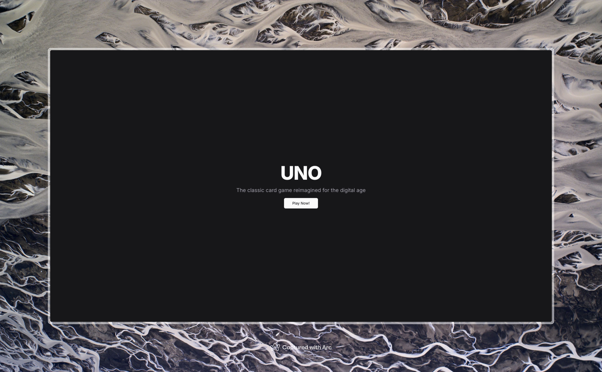
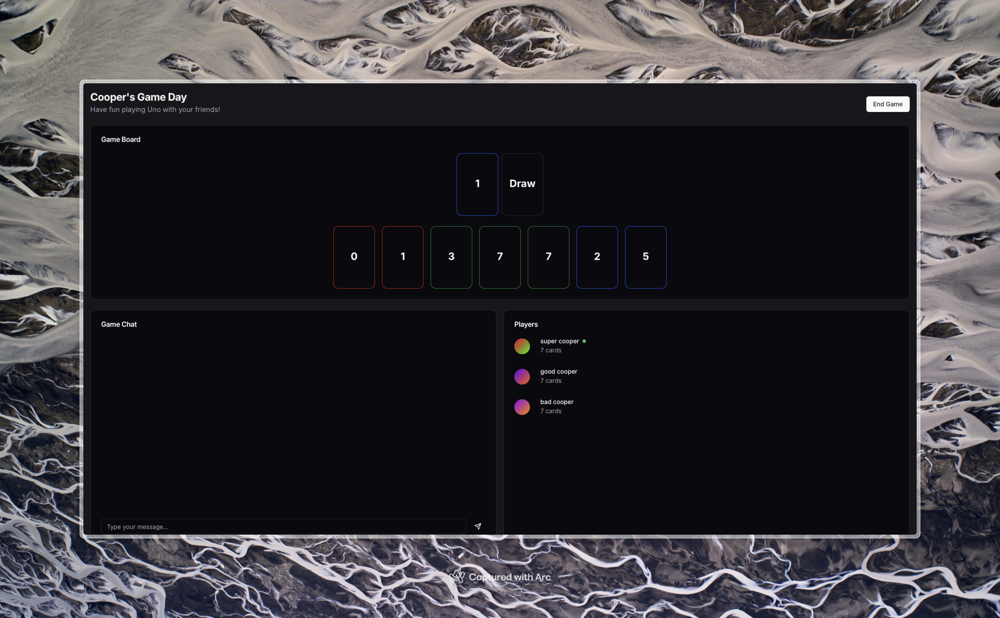
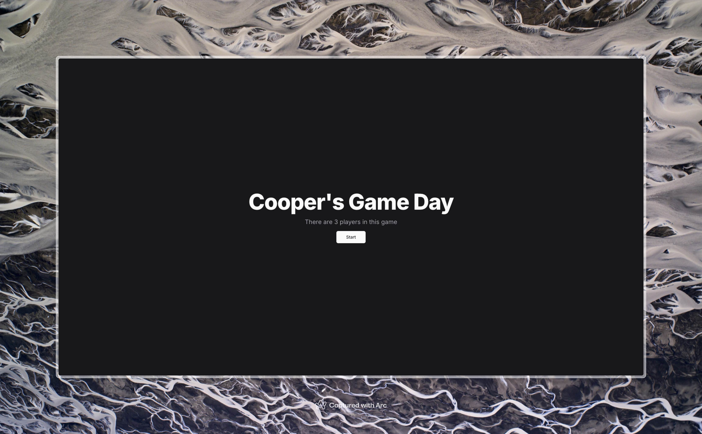
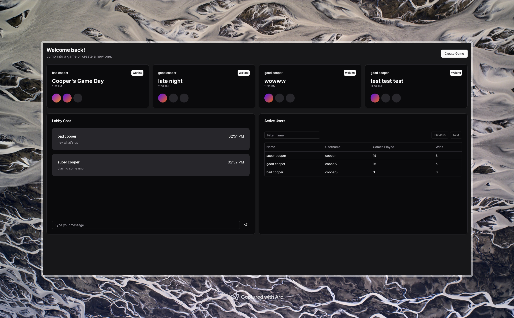
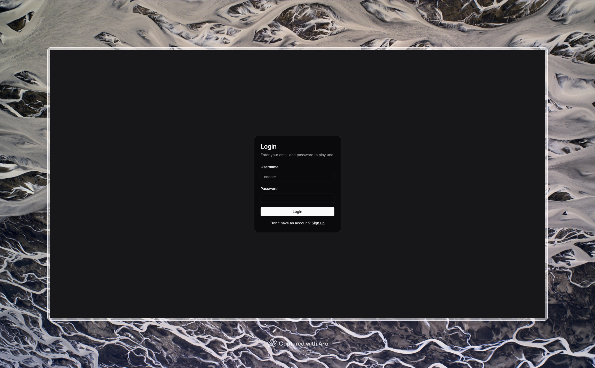
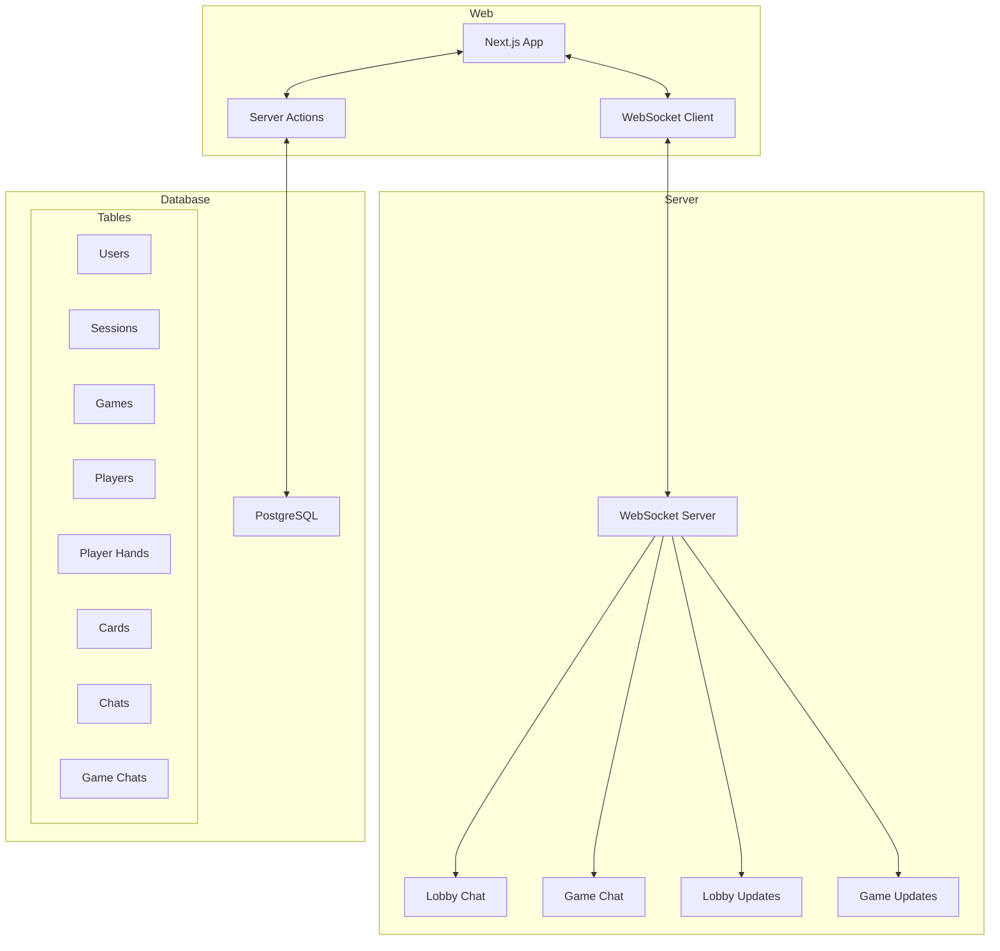

# UNO Online

A real-time multiplayer UNO game built with Next.js and Go.


Clean and simple UNO game with real-time updates

## Features

### Gameplay


Full UNO implementation with SVG cards and real-time updates


Game over screen with winner


Start the game when all players join

### Lobby


Real-time lobby with live chat, game creation, and active player statistics

### Authentication


Secure login and registration with token validation and password hashing


Register with credentials and nonce validation

### Game Features

- Turn-based gameplay with real-time updates
- Complete UNO card set:
  - Number cards (0-9)
  - Action cards (Skip, Reverse, Draw Two)
  - Wild cards (Wild, Wild Draw Four)
- UNO call-out system with penalties
- Auto turn progression
- Game state persistence

### Real-Time Features

- Real-time message handling:
  - Lobby chat and updates
  - Game chat and updates
- Immediate game state feedback

## Tech Stack

### Web

- Next.js 15 with App Router and Server Actions
- TypeScript for type safety
- Drizzle ORM with PostgreSQL
- Tailwind CSS + shadcn/ui components
- React Hook Form with Zod validation
- WebSocket client for real-time updates
- User session management
- Secure authentication with bcrypt
- Sonner for toast notifications

### Server

- Go 1.23
- Gorilla WebSocket
- Real-time message handling:
  - Lobby chat and updates
  - Game chat and updates

## System Architecture

Game state is managed through Next.js Server Actions with WebSocket notifications for real-time updates.



Connection Types:
- WebSocket: Real-time chat and state change notifications
- Server Actions: Game state management and mutations
- Database: State persistence and queries

## Database Schema

Tables use the prefix `uno_` in PostgreSQL for namespace isolation. Relations are defined using Drizzle ORM with TypeScript for type safety.

### Core Tables

Handles user authentication and session management. Provides the foundation for user interactions and security.

#### Users

Stores user accounts and authentication details

```ts
createTable("user", {
  id: integer("id").primaryKey().generatedByDefaultAsIdentity(),
  name: varchar("name", { length: 256 }).notNull(),
  username: varchar("username", { length: 256 }).unique().notNull(),
  password: varchar("password", { length: 256 }).notNull(),
})

relations(users, ({ many }) => ({
  sessions: many(sessions),
  players: many(players),
}))
```

#### Sessions

Tracks active user sessions

```ts
createTable("session", {
  id: integer("id").primaryKey().generatedByDefaultAsIdentity(),
  userId: integer("user_id").references(() => users.id).notNull(),
  token: varchar("token", { length: 250 }).notNull(),
  expiresAt: timestamp("expires_at").notNull(),
})

relations(sessions, ({ one }) => ({
  user: one(users, {
    fields: [sessions.userId],
    references: [users.id],
  }),
}))
```

### Game Management

Handles the core game logic, player turns, and game state transitions. Games progress through states (waiting → active → finished) while tracking player actions and card plays.

#### Games

Tracks active and completed game instances

```ts
const gameDirection = pgEnum("direction", [
  "clockwise", "counter_clockwise"
])

const gameStatus = pgEnum("status", [
  "waiting", "active", "finished"
])

createTable("game", {
  id: integer("id").primaryKey().generatedByDefaultAsIdentity(),
  name: varchar("name", { length: 256 }).notNull(),
  createdAt: timestamp("created_at").defaultNow().notNull(),
  createdBy: integer("created_by").references(() => users.id).notNull(),
  maxPlayers: integer("max_players").notNull(),
  topCardId: integer("top_card_id").references(() => cards.id).default(1),
  direction: gameDirection("direction").default("clockwise").notNull(),
  status: gameStatus("status").default("waiting").notNull(),
  currentTurn: integer("current_turn"), //userId
})

relations(games, ({ one, many }) => ({
  users: one(users, {
    fields: [games.createdBy],
    references: [users.id],
  }),
  card: one(cards, {
    fields: [games.topCardId],
    references: [cards.id],
  }),
  players: many(players),
  gameChats: many(gameChats),
}))
```

#### Players

Manages player participation and state

```ts
createTable("player", {
  id: integer("id").primaryKey().generatedByDefaultAsIdentity(),
  gameId: integer("game_id").references(() => games.id).notNull(),
  userId: integer("user_id").references(() => users.id).notNull(),
  turnOrder: integer("turn_order").notNull(),
  hasCalledUno: boolean("has_called_uno").notNull().default(false),
})

relations(players, ({ one, many }) => ({
  user: one(users, {
    fields: [players.userId],
    references: [users.id],
  }),
  game: one(games, {
    fields: [players.gameId],
    references: [games.id],
  }),
  playerHands: many(playerHands),
}))
```

#### PlayerHands

Links players to their current cards

```ts
createTable("player_hand", {
  id: integer("id").primaryKey().generatedByDefaultAsIdentity(),
  playerId: integer("player_id").references(() => players.id).notNull(),
  cardId: integer("card_id").references(() => cards.id).notNull(),
})

relations(playerHands, ({ one }) => ({
  player: one(players, {
    fields: [playerHands.playerId],
    references: [players.id],
  }),
  card: one(cards, {
    fields: [playerHands.cardId],
    references: [cards.id],
  }),
}))
```

### Card System

Defines the complete UNO card deck with all card types, colors, and special actions. Manages the relationship between cards and players.

#### Cards

Defines the UNO card deck

```ts
const cardColor = pgEnum("color", [
  "red", "green", "blue", "yellow", "wild"
])

const cardType = pgEnum("type", [
  "number", "draw_two", "reverse", "skip",
  "wild", "wild_draw_four"
])

createTable("card", {
  id: integer("id").primaryKey().generatedByDefaultAsIdentity(),
  color: cardColor("color").notNull(),
  type: cardType("type").notNull(),
  value: integer("value"),
})

relations(cards, ({ many }) => ({
  playerHands: many(playerHands),
}))
```

### Chat System

Provides real-time communication for both lobby and in-game chat. Supports global lobby messages and game-specific conversations.

#### Chats

Stores chat messages

```ts
createTable("chat", {
  id: integer("id").primaryKey().generatedByDefaultAsIdentity(),
  userId: integer("user_id").references(() => users.id).notNull(),
  message: text("message").notNull(),
  sentAt: timestamp("sent_at").notNull().defaultNow(),
})

relations(chats, ({ one }) => ({
  user: one(users, {
    fields: [chats.userId],
    references: [users.id],
  }),
}))
```

#### GameChats

Links chats to specific games

```ts
createTable("game_chat", {
  id: integer("id").primaryKey().generatedByDefaultAsIdentity(),
  gameId: integer("game_id").references(() => games.id).notNull(),
  chatId: integer("chat_id").references(() => chats.id).notNull(),
})

relations(gameChats, ({ one }) => ({
  game: one(games, {
    fields: [gameChats.gameId],
    references: [games.id],
  }),
  chat: one(chats, {
    fields: [gameChats.chatId],
    references: [chats.id],
  }),
}))
```

## Deployment

- Vercel for Next.js web application
  - Server Actions for game state management
  - Automatic deployments from main branch
  - Edge network distribution
- Render for Go WebSocket server
  - Real-time chat messaging
  - State change notifications
- Neon for PostgreSQL database
  - Serverless PostgreSQL
  - Auto-scaling storage
  - Point-in-time recovery
