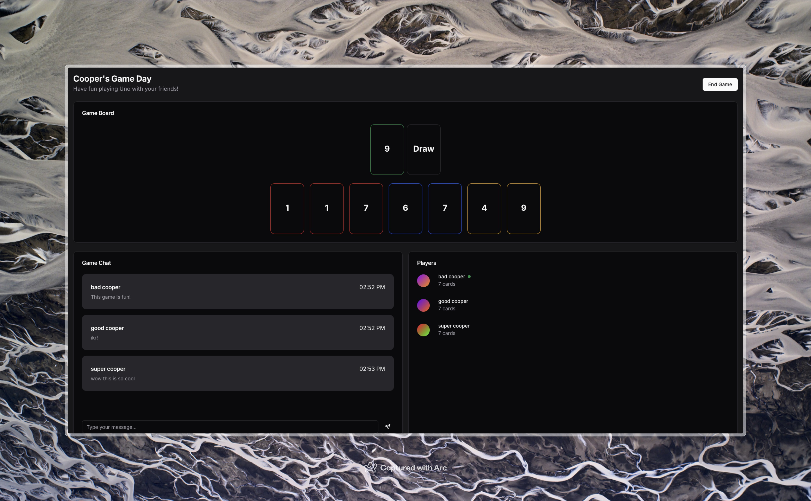
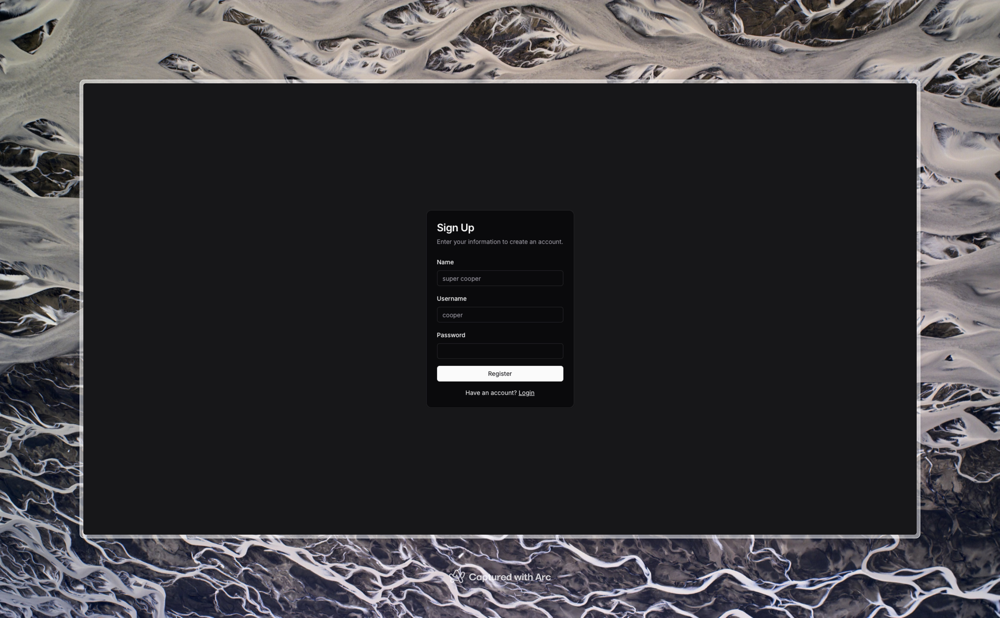

# UNO Online

A real-time multiplayer UNO game built with Next.js and Go.

Clean and simple UNO game with real-time updates

## Features

### Gameplay

Full UNO implementation with SVG cards and real-time updates

Game over screen with winner

Start the game when all players join

### Lobby

Real-time lobby with live chat, game creation, and active player statistics

### Authentication

Secure login and registration with token validation and password hashing

Register with credentials and nonce validation

### Game Features

- Turn-based gameplay with real-time updates
- Complete UNO card set:
  - Number cards (0-9)
  - Action cards (Skip, Reverse, Draw Two)
  - Wild cards (Wild, Wild Draw Four)
- UNO call-out system with penalties
- Auto turn progression
- Game state persistence

### Real-Time Features

- Instant game state updates
- Live chat in lobby and games
- Dynamic player joining/leaving
- Immediate card play feedback

## Tech Stack

### Web

- Next.js 15 with App Router and Server Actions
- TypeScript for type safety
- Drizzle ORM with PostgreSQL
- Tailwind CSS + shadcn/ui components
- React Hook Form with Zod validation
- WebSocket client for real-time updates
- User session management
- Secure authentication with bcrypt
- Sonner for toast notifications

### Server

- Go 1.23
- Gorilla WebSocket
- Real-time message handling:
  - Lobby chat
  - Game chat
  - Game state updates
  - Player actions
